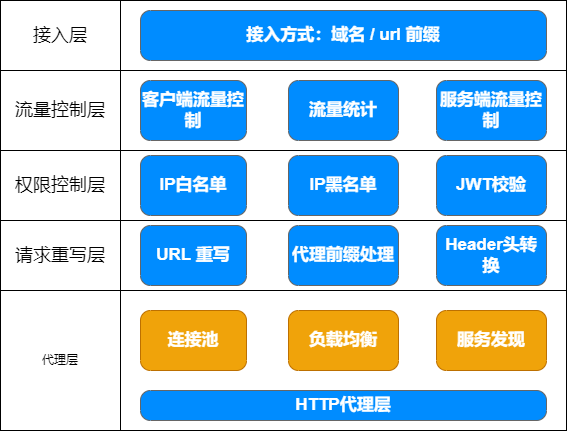

# LIGHT-GATEWAY（轻量级网关）

> 此项目意在实现网关常用需求，结合项目前端可视化配置项目进行项目管理，减轻网关配置压力

1. 反向代理服务器
2. 负载均衡
   ...

## 当前完成的功能

> 后台服务端

运行程序 `go run main.go` 进入 `http://127.0.0.1:2401/api/v1/swagger/index.html`

```
build.sh
此文件为 swag 生成使用文件
```

## 后台功能

### 管理员

登录，退出，登录信息，修改密码

## 状态码

```
1001    json数据错误
1002    数据库查询无结果或密码错误
1003    数据库储存失败
1004    数据库删除失败
1005    数据库存在无法保存
2001    未传递token
2002    token解析失败
```

## 核心模块


